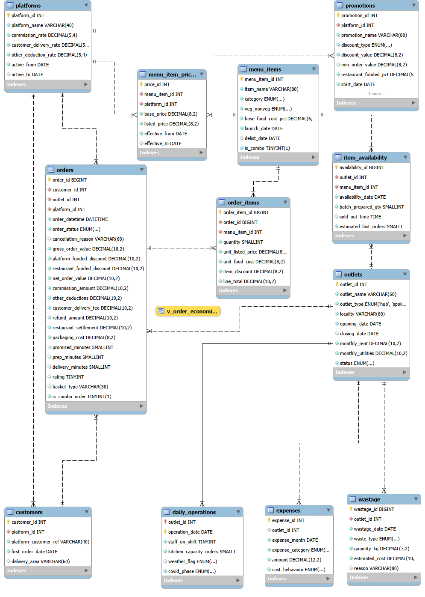

# Cloud Kitchen Unit Economics — SQL Analytics

I co-founded and ran E-Table Foods, a delivery-only cloud kitchen in Chennai. This project reconstructs the unit economics of that business in SQL using a synthetic transactional dataset calibrated to the operating figures I remember from running it.

The finding I did not see while operating the business was simple: **weekends were the profit engine.** Weekdays averaged 24 orders and cleared their daily fixed cost by only ₹193, while weekends averaged 53.6 orders and cleared it by ₹4,563. Although weekends represented just 28.5% of the calendar, they generated 90.4% of the profit.

I ran a real cloud kitchen.
        ↓
The original database is gone.
        ↓
I reconstructed its unit economics.
        ↓
I validated the synthetic dataset 33/33.
        ↓
SQL revealed something I didn't know while operating:
the business earned most of its profit on weekends.


Real / recalled
	↓
Business-level operating anchors

Synthetic
	↓
Individual transactions and transactional detail

Computed
	↓
SQL findings

## Dataset disclosure

> **Synthetic transactional dataset generated to match the real unit economics of a cloud kitchen I co-founded and operated for four years.**
>
> The original production database, dashboards and reports are no longer accessible.
>
> **Real and recalled:** order volumes, average order value, platform commission, food-cost ratio, rent, utilities, packaging cost, staffing, platform history and shutdown dates, outlet expansion, COVID impact, and the survivable order floor.
>
> **Synthetic:** every transaction row, every customer, every item-level price and cost, discount allocation per order, delivery and preparation times, daily order distribution, and the two synthetic outlet localities.


## Key findings

* **Weekend economics:** Weekends were 28.5% of trading days but generated **90.4% of profit**. Weekdays cleared fixed costs by ₹193/day; weekends by ₹4,563/day.
* **Breakeven:** The reconstructed business needed **17.5–22.6 orders/day**, depending on whether the calculation loaded only outlet costs or full company overhead. My recalled operating floor of roughly 20 orders/day falls between the two.
* **Expansion:** The original outlet generated **137.3% of company profit** because the later outlets were net-negative across their operating periods. Expansion added revenue but reduced lifetime outlet profitability.
* **Inventory decision:** Limited-batch production sacrificed roughly **₹642/day of contribution to save ₹2/day of waste** on days when 1–2 items stocked out. That was an operating decision I got wrong.

## The business

E-Table Foods was a delivery-only cloud kitchen in Chennai operating from February 2018 to November 2022. I co-founded the business and ran operations and sales.

The business was built around aggregator-led delivery through Swiggy, Zomato, UberEats and Foodpanda, with a hub-and-spoke operating model as it expanded from one outlet to three.

Orders were received through aggregator platforms, prepared in the kitchen, packaged and handed to platform delivery riders. The business operated without dine-in or walk-in trade.

The analytical problem was not simply revenue reporting. I needed to understand contribution, fixed-cost absorption, outlet economics, menu performance, platform economics, customer behaviour and operational trade-offs.

The original production database, dashboards and reports are no longer accessible. This project reconstructs the transactional layer and answers those operating questions in SQL.

## Data model



**12 tables · 300,051 rows · 57 months · MySQL 8.0**

The model is centred on `orders`, with `order_items` providing item-level detail and supporting tables representing customers, outlets, platforms, menu items, pricing history, promotions, availability, wastage, expenses and daily operating conditions.

The schema follows 3NF with two deliberate point-in-time snapshot exceptions:

* `orders.commission_amount` preserves the commission actually assigned to the historical order rather than requiring a later temporal lookup.
* `order_items.unit_food_cost` preserves food cost at the time of the order so historical margin does not change when current costs change.

These are intentional financial snapshots, not accidental duplication.

[View the full ER diagram and design decisions](docs/03_er_diagram.md) · [View the data dictionary](docs/02_data_dictionary.md)


## How to reproduce

The project is reproducible from the repository using the synthetic-data generator, reconciliation harness and MySQL scripts.

### 1. Generate the dataset

```bash
cd generator
python generate.py
```

This creates the 12 CSV files in `data/`.

### 2. Reconcile the generated data

```bash
python reconcile.py
```

The generated business must pass the full reconciliation gate before the SQL analysis is trusted.

**Expected result:**

```text
33/33 checks passed
```

The full reconciliation output is preserved in [`results/reconciliation_report.txt`](results/reconciliation_report.txt).

### 3. Build the MySQL database

Enable `local_infile` for the MySQL server and client, then run:

```bash
cd ..
mysql --local-infile=1 -u root -p < sql/01_schema.sql
mysql --local-infile=1 -u root -p etable_analytics < sql/02_load.sql
mysql -u root -p etable_analytics < sql/03_validate.sql
```

The schema creates the 12-table relational model. `02_load.sql` loads the generated CSVs, and `03_validate.sql` checks the post-load row counts, referential integrity and hard business constraints.

### 4. Run the analysis

The SQL analysis is organised into seven modules:

```text
sql/10_data_quality.sql
sql/20_unit_economics.sql
sql/30_menu_engineering.sql
sql/40_covid_analysis.sql
sql/50_customer_analysis.sql
sql/60_operations.sql
sql/70_optimisation.sql
```

Python is used for dataset generation and validation only. **All business analysis and findings are derived in SQL.**

## Reconciliation

The generator does not write directly to target outputs.

It generates transactions from behavioural rules such as demand curves, basket composition, price lookups, discount incidence, stockout probability and operating conditions. A separate reconciliation harness then measures whether the resulting business falls within the recalled operating ranges.

**33 reconciliation checks passed after six calibration passes. Behavioural parameters were tuned; outputs were never manually patched.**

The final validation included exact hard constraints such as:

* 28.0% platform commission
* ₹15.00 packaging per applicable order
* zero UberEats orders after January 2020
* zero Foodpanda orders after September 2019
* zero months with zero wastage

It also tested whether the generated business fell within recalled operating ranges for order volume, AOV, food cost, wastage, profitability, cancellations, refunds, delivery performance and recovery from COVID.

[View the full reconciliation report](results/reconciliation_report.txt) · [View the assumptions and reconstruction methodology](docs/04_assumptions_log.md)


## Analysis modules

The analysis is organised around business questions rather than SQL techniques.

| Module                   | File                                                           | Question it answers                                                                            |
| ------------------------ | -------------------------------------------------------------- | ---------------------------------------------------------------------------------------------- |
| Data quality & profiling | [`sql/10_data_quality.sql`](sql/10_data_quality.sql)           | What is in the data, what needs cleaning, and what does each order status mean?                |
| Unit economics           | [`sql/20_unit_economics.sql`](sql/20_unit_economics.sql)       | Did the business make money, and which outlets and platforms actually created value?           |
| Menu engineering         | [`sql/30_menu_engineering.sql`](sql/30_menu_engineering.sql)   | Which menu items should have been protected, improved, promoted or reviewed for delisting?     |
| COVID shock              | [`sql/40_covid_analysis.sql`](sql/40_covid_analysis.sql)       | Why did the demand shock become a profitability and survival problem?                          |
| Customer analysis        | [`sql/50_customer_analysis.sql`](sql/50_customer_analysis.sql) | Who ordered again, how did cohorts behave, and what did the basket distribution hide?          |
| Operations               | [`sql/60_operations.sql`](sql/60_operations.sql)               | How did stockouts, delivery times and kitchen utilisation affect the economics?                |
| Query optimisation       | [`sql/70_optimisation.sql`](sql/70_optimisation.sql)           | How does MySQL reach the answer, and where do indexing, sargability and reusable logic matter? |

The detailed business interpretations for the major queries are documented in [`docs/05_insights_summary.md`](docs/05_insights_summary.md).

## What I would do differently

### 1. Raise batch sizes on the highest-volume items

**Source:** F1 · **Impact:** ~₹19,500/month per outlet *(estimated)*

The analysis showed that limited-batch production could sacrifice roughly ₹642/day of contribution to save only ₹2/day of waste on days when 1–2 items stocked out. I would accept controlled additional waste to protect availability of the items that drive the most demand.

[See the full recommendation](docs/06_recommendations.md)

### 2. Test breakeven before opening another outlet

**Source:** B2, D3 · **Impact:** up to ~₹4.77 L of Outlet 3 lifetime loss exposure *(estimated)*

I would calculate the new outlet's contribution per order, fixed-cost base and required order volume before signing a lease, then define a ramp-up period and stop-loss threshold rather than assuming the original outlet's economics would transfer.

[See the full recommendation](docs/06_recommendations.md)

### 3. Manage weekdays and weekends as different operating models

**Source:** D4 · **Impact:** *(judgement)*

Weekdays were almost breakeven after fixed cost, while weekends generated 90.4% of profit. I would keep weekday operations lean and protect weekend throughput, inventory availability and preparation capacity.

[See the full recommendation](docs/06_recommendations.md)


## Assumptions and limitations

This is a reconstruction, not a recovered copy of the original production database.

The transactional records, customer records, item-level prices and costs, discount allocations, delivery and preparation times, and other detailed transaction-level fields are synthetic. They were generated to reproduce the recalled operating characteristics of the business and validated through a separate 33-check reconciliation process.

Key limitations:

* **Synthetic transactions:** individual orders and customer behaviours are not historical facts.
* **Derived item economics:** item-level prices and food costs were constructed to reconcile with business-level anchors rather than recalled individually.
* **Platform-scoped customers:** aggregators did not provide restaurant-level customer identity, so repeat behaviour can be analysed within a platform but cross-platform customer identity cannot be established.
* **Promotional incrementality:** there is no holdout/control group, so the analysis can separate restaurant-funded and platform-funded discounts but cannot prove incremental promotional lift.
* **Retrospective menu engineering:** the Kasavana–Smith framework was applied to the reconstructed dataset; it was not a framework used at E-Table while the business was operating.
* **Synthetic outlet localities:** two of the three outlet localities are synthetic and should not be interpreted as historical E-Table locations.
* **Causality:** where multiple operating changes occurred during the same period, the analysis identifies patterns and associations but does not claim causal attribution that the data cannot support.

For the full reconstruction methodology, contradictions, hard constraints, calibration ranges and synthetic assumptions, see [`docs/04_assumptions_log.md`](docs/04_assumptions_log.md).

## Tech stack

**MySQL 8.0 · MySQL Workbench · Python 3 · Git**

Python was used for **dataset generation and validation only**. The business analysis, financial calculations, operational analysis, menu engineering, customer analysis and query optimisation were performed in **SQL**.
